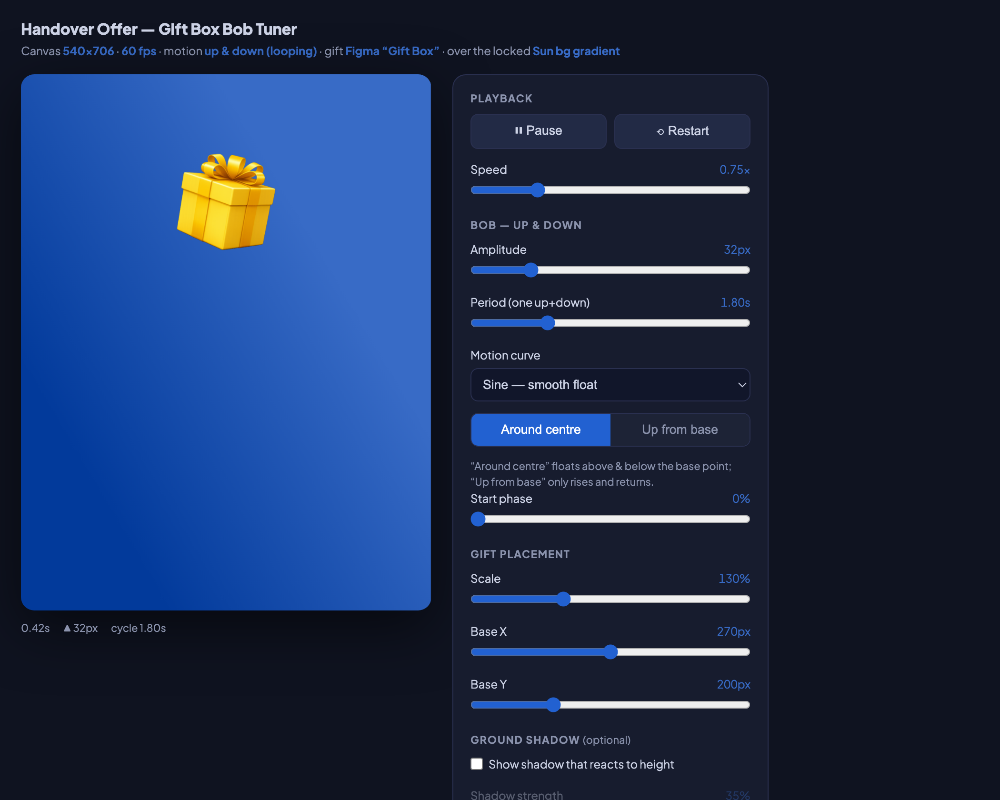

# 🎁 Gift Box Bob Tuner

A single self-contained HTML page to **visually tune a gift box "bob" (float up & down)** — then export the exact motion as JSON to bake into a production animation (GIF, Lottie, or in-app).

No build. No dependencies. No server. **Open `index.html` and drag sliders.**



---

## What it does

- Renders a **540 × 706** stage with a transparent gift PNG floating up and down over a gradient.
- Sliders/toggles for: **amplitude**, **period**, **motion curve** (sine / hang / linear), **mode** (float around centre vs. rise-from-base), start phase, scale, X/Y position, optional ground shadow, background gradient.
- **💾 Save config** → `gift-box-config.json`; **⧉ Copy** to clipboard.

▶︎ **Live demo:** enable GitHub Pages → `https://manvendrakumar-hub.github.io/gift-box-tuner/`

---

## The "tuner-first" workflow (why this exists)

Motion feel — *how far it bobs, how fast, how much it "hangs" at the top* — is a taste decision best made **by eye**, not by editing numbers in code and rebuilding. This tuner is a slider playground; you tune live, hit **Save config**, and that JSON is the clean hand-off that gets baked into the final render. (Real example: the bob was retuned from amplitude 32/period 1.8s to amplitude 22 with a slower playback — a 30-second slider session, no code edits.)

---

## How it works (codebase walkthrough)

One HTML file: **stage + panel + script**.

### The bob math
A `requestAnimationFrame` loop advances a time accumulator `t`; vertical offset is a function of `t`:

```js
const SHAPE = {
  sine:   f => Math.sin(2*Math.PI*f),                                  // smooth float
  hang:   f => { const s=Math.sin(2*Math.PI*f); return Math.sign(s)*Math.pow(Math.abs(s),0.6); }, // hangs at extremes
  linear: f => { f-=Math.floor(f); return f<.25? f*4 : f<.75? 2-4*f : 4*f-4; },  // triangle
};

function upAt(t){
  const f = (t/period) + startPhase;
  if(mode==="base") return amp*(0.5 - 0.5*Math.cos(2*Math.PI*(f%1)));   // only rises from base
  return amp*SHAPE[curve](f);                                          // floats above & below centre
}
// render: translate(-50%,-50%) translateY(-upAt(t)) scale(...)
```

That's the entire engine — a sine wave (or variant) driving `translateY`. The "around centre" mode oscillates ±amp; "up from base" only goes up and returns (a raised-cosine, so it eases at both ends).

### Config in / out
`currentConfig()` serializes the state to a JSON object (canvas, bob params, gift placement, background). Save downloads it; Copy clipboards it.

---

## Build your own tuner (the recipe)

The skeleton is identical for any effect — swap the engine:

1. **Stage + panel** — a fixed preview box + a column of `<input type="range">`.
2. **One state object** holding every tunable value.
3. **`render()`** reads state → paints one frame; called from a `requestAnimationFrame` loop.
4. **Wire sliders**: `inp.addEventListener('input', e => state.x = +e.target.value)`.
5. **`currentConfig()` + Save/Copy** — serialize to JSON; download via `Blob`+`<a download>`, copy via `navigator.clipboard`.
6. **Self-contained** — embed the gift image as a `data:` URI so the file is one portable artifact.

The gift engine is the simplest of the family (one sine), which makes this repo the best starting template to copy.

---

## Learnings & gotchas

**1. Slider changes are runtime-only — they do NOT persist to the file.**
Dragging a slider mutates in-memory state; it never rewrites the HTML. The **only** way to capture a tune is **Save config** (or read the values back). Early on a tuned gift looked perfect on screen but the file still had defaults — because nothing was saved. Make the Save button obvious.

**2. Tight-crop the source PNG to its content box.**
Export padding around the gift makes positioning unpredictable. Crop to the visible bounding box first (`Image.getbbox()`), then placement maths are exact.

**3. Keep amplitude in stage pixels, independent of scale.**
Decide whether the bob distance scales with the gift or stays fixed in canvas px. We kept amplitude in stage px so resizing the gift doesn't change how far it travels.

**4. Effective speed = period ÷ playback-speed.**
The tuner has both a `period` and a playback `speed` multiplier. When baking, the real-world period is `period / speed` (e.g., 1.1s ÷ 0.45 ≈ 2.44s). Fold them into one number for the renderer.

---

## Config reference

| Key | Meaning |
|---|---|
| `bob.amplitudePx` | peak travel distance (stage px) |
| `bob.periodSec` | seconds for one full up+down |
| `bob.curve` | `sine` \| `hang` (more dwell at extremes) \| `linear` |
| `bob.mode` | `centre` (±amp) or `base` (rise & return) |
| `gift.scalePct` / `baseX` / `baseY` | size and position |
| `playback.speed` | preview speed multiplier (effective period = periodSec ÷ speed) |

See `example-config.json`.

---

## License
MIT — see [LICENSE](LICENSE). Built as part of the Lenskart "Handover Offer" animation system.
